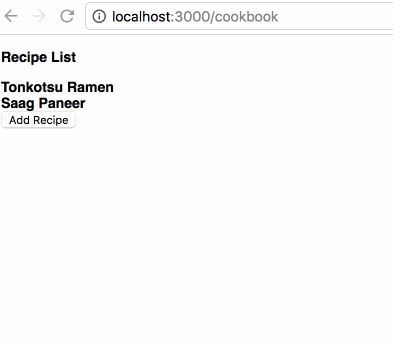

# cookbook [![NPM version][npm-image]][npm-url] [![Build Status][travis-image]][travis-url] [![Dependency Status][daviddm-image]][daviddm-url]
>

## Installation

```sh
$ npm install
```

## Usage

```bash
gulp dev
```

Visit http://localhost:3000/cookbook

## Screenshots



## License

Apache-2.0 © [Guy Morita]()


[npm-image]: https://badge.fury.io/js/cookbook.svg
[npm-url]: https://npmjs.org/package/cookbook
[travis-image]: https://travis-ci.org/guymorita/cookbook.svg?branch=master
[travis-url]: https://travis-ci.org/guymorita/cookbook
[daviddm-image]: https://david-dm.org/guymorita/cookbook.svg?theme=shields.io
[daviddm-url]: https://david-dm.org/guymorita/cookbook
